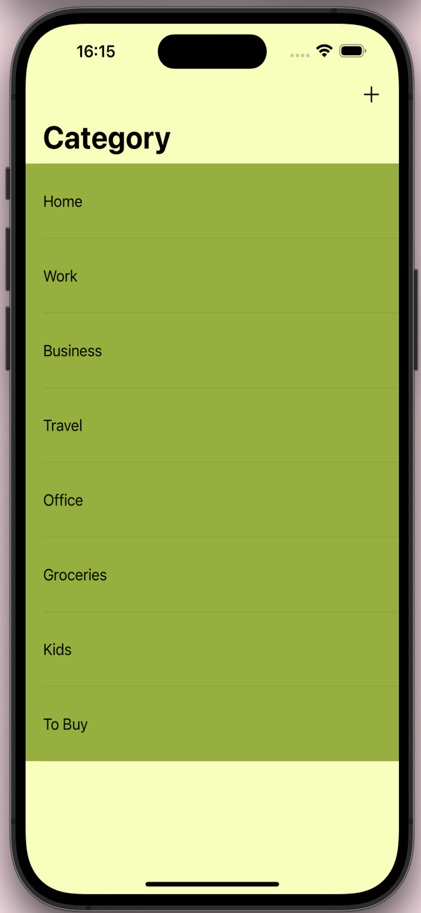
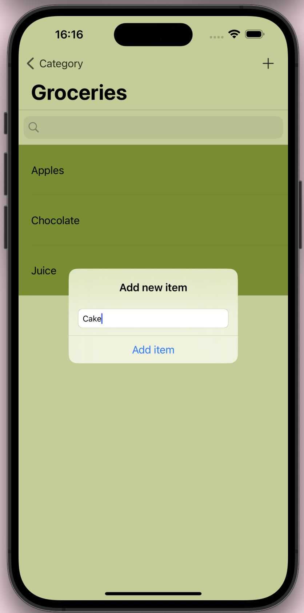
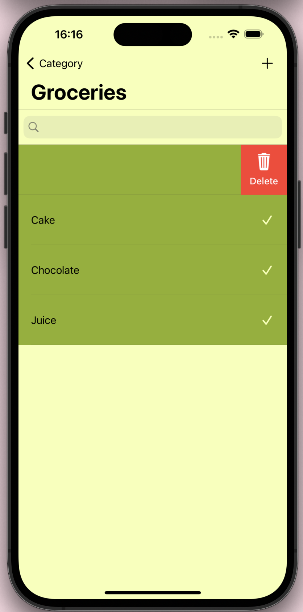

# To Do List - iPhone App

<h4>⬇️ Used CocoaPods🥥 ⬇️ </h4>
  📙 Realm for data persistance  
  🗑️ SwipeCellKit for swipe-able item delete effect (like Mail app)  
  🎨 ChameleonFramework for colors  
   

  
 

